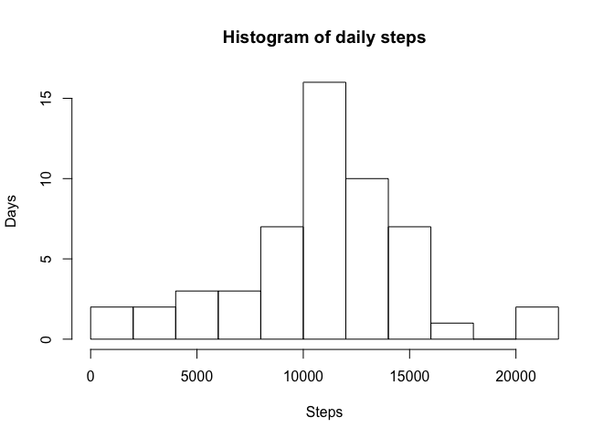
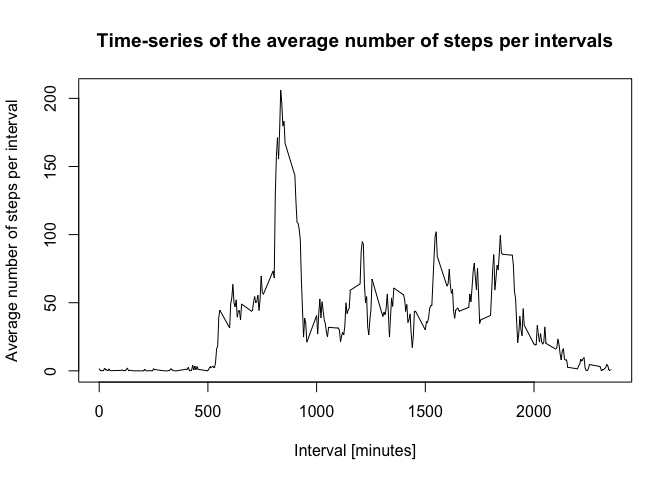
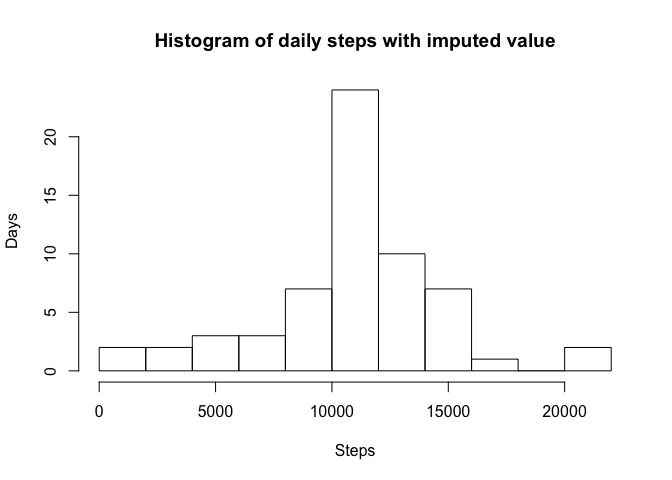
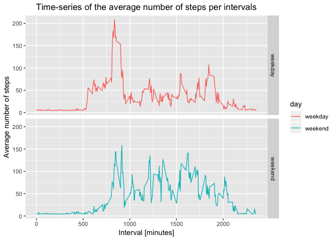

## Loading and preprocessing the data

```r
setwd("/Users/Wei-Ting/Desktop/R course/course 5")
data <- read.csv(file = "activity.csv")
library(ggplot2)
```


## What is mean total number of steps taken per day?
### Mean and median number of steps taken each day

```r
daily.data <- aggregate(steps ~ date, data, sum)
summary(daily.data$steps, digits = 5)
```

```
##    Min. 1st Qu.  Median    Mean 3rd Qu.    Max. 
##      41    8841   10765   10766   13294   21194
```
as showed in the summary, median is 10765 and mean is 10766.

### Histogram of the total number of steps taken each day

```r
daily.data <- aggregate(steps ~ date, data, sum)
hist(daily.data$steps, xlab="Steps", ylab= "Days", breaks = 10, main="Histogram of daily steps")
```

<!-- -->


## What is the average daily activity pattern?
### Time series plot of the average number of steps taken

```r
mean.interval <- aggregate(steps ~ interval, data, mean)
plot(mean.interval$interval, mean.interval$steps, type = "l",
     xlab="Interval [minutes]", 
     ylab="Average number of steps per interval", 
     main="Time-series of the average number of steps per intervals")
```

<!-- -->

### The 5-minute interval that, on average, contains the maximum number of steps

```r
max.position <- which(mean.interval$steps == max(mean.interval$steps))
max.interval <- mean.interval[max.position, ]
print(max.interval)
```

```
##     interval    steps
## 104      835 206.1698
```
The 5-minute interval that contains the maximum of steps is 835 which averaged at 206 steps


## Imputing missing values
### replace NA by data mean

```r
NA.numbers <- sum(is.na(data$steps))
print(NA.numbers) # The number of NA’s is 2304
```

```
## [1] 2304
```

```r
data$steps[is.na(data$steps)] <- mean(data$steps, na.rm = T) 
```

### Histogram of the total number of steps taken each day after missing values are imputed

```r
complete.daily.data <- aggregate(steps ~ date, data, sum)
summary(complete.daily.data$steps, digits = 5)
```

```
##    Min. 1st Qu.  Median    Mean 3rd Qu.    Max. 
##      41    9819   10766   10766   12811   21194
```

```r
hist(complete.daily.data$steps, xlab="Steps", ylab= "Days", breaks = 10, 
     main="Histogram of daily steps with imputed value")
```

<!-- -->
Since I impute missing value by dataset mean, it does not affect too much on mean and median. For distribution, after imputed, it concentrated even more on the mean.


## Are there differences in activity patterns between weekdays and weekends?

```r
weekday.or.weekend <- function(date) {
  day <- weekdays(date)
  if (day %in% c("Monday", "Tuesday", "Wednesday", "Thursday", "Friday"))
    return("weekday")
  else if (day %in% c("Saturday", "Sunday"))
    return("weekend")
  else
    stop("invalid date")
}
data$date <- as.Date(data$date)
```

```
## Warning in strptime(xx, f <- "%Y-%m-%d", tz = "GMT"): unknown timezone
## 'zone/tz/2018i.1.0/zoneinfo/America/Los_Angeles'
```

```r
data$day <- sapply(data$date, FUN = weekday.or.weekend)
averages <- aggregate(steps ~ interval + day, data, mean)
ggplot(averages, aes(interval, steps, color = day)) + geom_line() + 
  facet_grid(day ~ .) +
  ggtitle("Time-series of the average number of steps per intervals") +
  xlab("Interval [minutes]") + ylab("Average number of steps") + 
  theme(plot.title = element_text(hjust = 0.5))
```

<!-- -->
